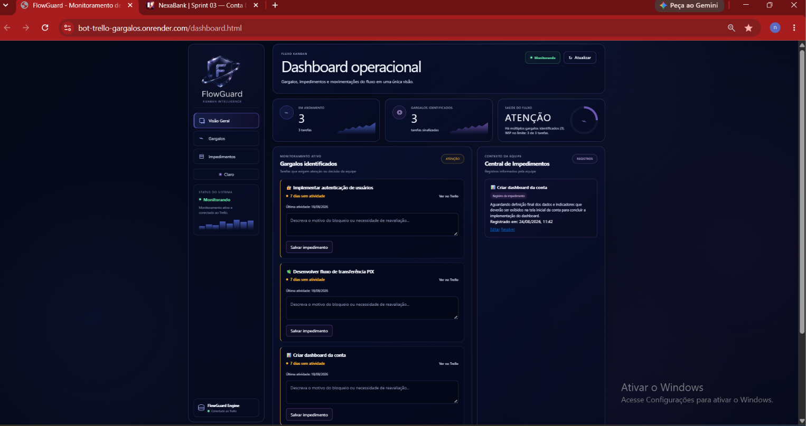
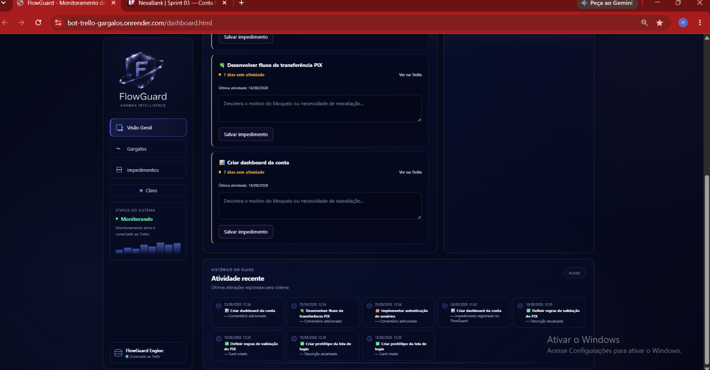
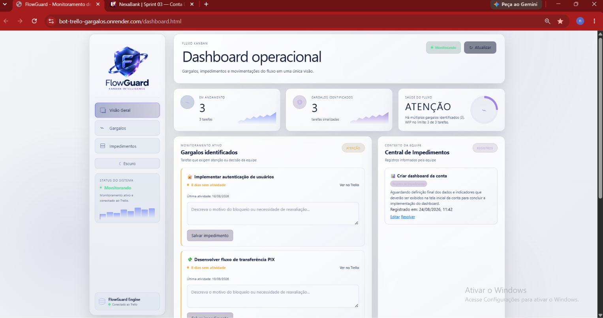
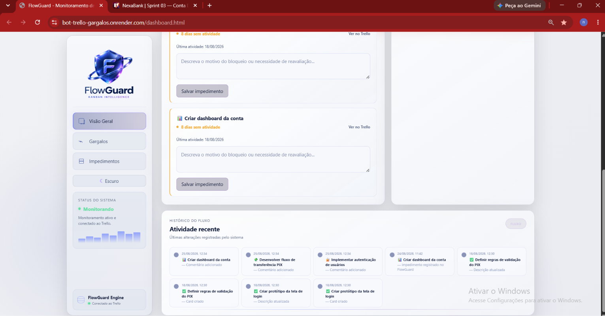

# FlowGuard

**Monitoramento inteligente de gargalos e impedimentos em fluxos Kanban integrados ao Trello.**

O **FlowGuard** é um MVP desenvolvido para apoiar o acompanhamento de equipes que utilizam métodos ágeis, identificando automaticamente tarefas potencialmente paradas, situações de sobrecarga do trabalho em andamento (WIP) e impedimentos registrados pela equipe.

A solução integra-se à API do Trello e combina automação com uma dashboard própria, reunindo informações sobre o estado do fluxo, possíveis gargalos, impedimentos e atividades recentes em uma única interface.

> Projeto desenvolvido no contexto de Iniciação Científica a partir da pesquisa **“Integração de Bots em Projetos Ágeis: Menos Gargalos, Mais Resultados”**.

---

## Sobre o projeto

Em equipes que trabalham com métodos ágeis e utilizam quadros Kanban, uma tarefa pode permanecer em andamento por vários dias sem que essa situação seja percebida imediatamente. O excesso de atividades simultâneas e a existência de impedimentos também podem comprometer o fluxo de trabalho.

O FlowGuard monitora cartões em andamento no Trello, analisa o período desde a última atividade relevante da equipe e sinaliza possíveis gargalos quando o limite configurado é atingido. A solução também acompanha o limite de trabalho em andamento (WIP), permite registrar impedimentos e reúne informações do quadro em uma dashboard web.

---

## Da Ágil IA ao FlowGuard

A proposta inicial da pesquisa previa o desenvolvimento de um bot denominado **Ágil IA**, voltado à identificação de possíveis gargalos em projetos ágeis.

Durante o desenvolvimento e os testes funcionais, o protótipo evoluiu. A solução deixou de atuar apenas como um bot responsável por analisar e comentar cartões do Trello e passou a incorporar uma interface própria para acompanhamento do fluxo, monitoramento de WIP, registro de impedimentos, histórico de atividades e automação periódica.

Essa evolução deu origem ao **FlowGuard**, identidade adotada para a versão atual do MVP.

O nome **Bot Gargalos** permanece apenas na detecção de comentários legados, para evitar que comentários produzidos por versões anteriores sejam tratados como atividade relevante.

---

## Principais funcionalidades atuais

- Monitoramento dos cartões da lista `Em andamento ` no Trello, incluindo o espaço final presente no nome configurado;
- identificação automática de possíveis gargalos;
- cálculo do tempo sem atividade relevante;
- comentários automáticos do **FlowGuard** nos cartões sinalizados;
- aplicação automática da etiqueta `Possível Gargalo`;
- remoção da etiqueta quando o cartão deixa de atender aos critérios;
- monitoramento do limite de trabalho em andamento (**WIP**);
- indicador visual da saúde do fluxo;
- Central de Impedimentos;
- registro, edição e resolução de impedimentos;
- visualização de atividades recentes;
- acesso direto aos cartões monitorados no Trello;
- dashboard responsiva;
- tema claro e escuro;
- monitoramento periódico configurável.

---

## Como funciona a detecção de gargalos

O FlowGuard monitora os cartões da lista configurada como **Em andamento**. Para cada cartão, o sistema busca as ações do Trello, identifica a última atividade relevante e calcula quantos dias se passaram desde essa ação.

Quando:

```text
dias sem atividade >= DIAS_PARADO
```

o cartão passa a ser considerado um possível gargalo.

Quando um possível gargalo é identificado, o FlowGuard:

1. sinaliza o cartão na dashboard;
2. adiciona a etiqueta `Possível Gargalo` no Trello, se ela ainda não estiver presente;
3. publica um comentário automático no cartão, caso ainda não exista comentário do FlowGuard ou de uma versão legada identificada como `Bot Gargalos`.

---

## Atividade relevante

O FlowGuard analisa as **actions** do cartão e desconsidera ações geradas pelo próprio sistema, evitando que seus comentários e etiquetas alterem artificialmente a referência de inatividade.

Atualmente são ignorados no cálculo:

- comentários cujo texto contenha `FlowGuard` ou `Bot Gargalos`;
- aplicação da etiqueta `Possível Gargalo`;
- remoção da etiqueta `Possível Gargalo`.

Entre as ações restantes, a data válida mais recente é usada. Quando não há uma action utilizável, o valor original de `dateLastActivity` é usado como fallback.

---

## Monitoramento de WIP

O FlowGuard acompanha o número de cartões presentes simultaneamente em **Em andamento**. O limite é definido por:

```env
LIMITE_CARDS_EM_ANDAMENTO=3
```

| Situação | Estado |
| --- | --- |
| Total abaixo do limite | Normal |
| Total igual ao limite | WIP no limite, sem sobrecarga |
| Total acima do limite | Sobrecarga |

A sobrecarga ocorre somente quando:

```text
totalEmAndamento > LIMITE_CARDS_EM_ANDAMENTO
```

---

## Central de Impedimentos

O FlowGuard permite registrar impedimentos associados aos cartões monitorados. A Central de Impedimentos permite:

- registrar um impedimento;
- visualizar data e horário do registro;
- editar o conteúdo;
- resolver e remover o impedimento;
- organizar os registros pela atualização mais recente.

Na versão atual do MVP, os impedimentos são armazenados no `localStorage` do navegador. Esses dados pertencem ao ambiente local utilizado para acessar a dashboard e não são compartilhados automaticamente entre dispositivos ou usuários.

---

## Atividade recente

A dashboard apresenta movimentações recentes relacionadas ao quadro, incluindo:

- criação de cartões;
- movimentação entre listas;
- comentários;
- alterações de descrição, nome e estado de arquivamento;
- registros locais relacionados aos impedimentos.

Alterações de posição sem outra mudança relevante são ignoradas. O servidor limita a resposta a 12 eventos, e a dashboard exibe no máximo 8 após combinar os dados do Trello com os registros locais.

Comentários automáticos do FlowGuard podem aparecer nesta lista, pois a filtragem usada para a atividade recente é diferente da filtragem usada no cálculo de inatividade.

---

## Automação periódica

O backend executa a rotina de análise imediatamente após iniciar o servidor e, depois, em intervalos configuráveis:

```env
INTERVALO_ANALISE_MS=900000
```

O valor acima corresponde a **15 minutos**. Valores inferiores a 60 segundos são substituídos pelo padrão de 15 minutos. A rotina evita execuções sobrepostas e inicia em paralelo a análise de gargalos e a verificação/correção de etiquetas.

O botão **Atualizar** da dashboard apenas recarrega os dados exibidos; ele não dispara comentários nem alterações no Trello.

---

## Tecnologias utilizadas

### Backend

- Node.js;
- Express;
- Axios;
- Dotenv.

### Frontend

- HTML5;
- CSS3;
- JavaScript vanilla.

### Integração e persistência

- Trello REST API;
- Web Storage API (`localStorage`).

### Versionamento

- Git;
- GitHub.

---

## Arquitetura simplificada

```text
Trello REST API
	|
	v
FlowGuard (Node.js / Express)
	|
	+--> Análise automática: gargalos, comentários e etiquetas
	+--> API da dashboard: /dados e /atividade
				  |
				  v
		      Dashboard HTML / CSS / JS
				  |
				  v
		      localStorage: impedimentos e tema
```

---

## Variáveis de ambiente

Crie um arquivo `.env` na raiz do projeto tomando como referência `.env.example`:

```env
TRELLO_KEY=
TRELLO_TOKEN=
DIAS_PARADO=5
LIMITE_CARDS_EM_ANDAMENTO=3
INTERVALO_ANALISE_MS=900000
```

O servidor também aceita `PORT`; quando não informado, utiliza a porta `3000`. As credenciais do Trello não devem ser versionadas no Git. O quadro, o nome da lista e o nome da etiqueta monitorados atualmente estão definidos no código.

---

## Como executar localmente

```bash
git clone https://github.com/stumpfdenise/bot-trello-gargalos.git
cd bot-trello-gargalos
npm install
```

Crie o arquivo `.env` com base em `.env.example` e preencha as credenciais necessárias do Trello. Em seguida, inicie a aplicação:

```bash
npm start
```

Por padrão, a aplicação fica disponível em `http://localhost:3000`.

---

## Interface

A dashboard responsiva centraliza a visualização do fluxo Kanban, gargalos identificados, impedimentos e atividades recentes.

A interface oferece temas claro e escuro, permitindo adaptar a visualização à preferência do usuário.

### Tema escuro





### Tema claro





---

## Testes e validação do MVP

O desenvolvimento ocorreu de maneira incremental, com validações manuais realizadas diretamente sobre um quadro utilizado como ambiente de demonstração. Foram avaliados cenários de detecção de cartões parados, limites de dias, etiquetas, comentários duplicados, correção de etiquetas, WIP, impedimentos, registros locais anteriores, responsividade e temas.

O projeto não possui testes automatizados configurados no `package.json`. A validação depende atualmente de verificações manuais e da disponibilidade do quadro e da API do Trello.

---

## Limitações atuais

O FlowGuard é um **MVP acadêmico**. Entre as limitações atuais estão:

- configuração direcionada a um quadro e fluxo específicos;
- dependência dos nomes configurados para lista e etiqueta;
- armazenamento dos impedimentos apenas no navegador;
- ausência de autenticação, usuários e banco de dados;
- ausência de histórico persistente próprio de métricas;
- ausência de testes automatizados;
- dependência da disponibilidade e dos limites da API do Trello;
- execução periódica dependente da disponibilidade do processo do backend;
- ausência de configuração específica de deploy ou de scheduler dedicado.

---

## Melhorias futuras

Possibilidades fora do escopo atual do MVP incluem:

- banco de dados para persistência compartilhada;
- autenticação e gerenciamento de usuários;
- suporte a múltiplas equipes e quadros;
- configuração de regras pela interface;
- histórico de gargalos e impedimentos resolvidos;
- métricas, relatórios e indicadores de fluxo;
- notificações configuráveis;
- worker ou scheduler dedicado;
- suporte a outras plataformas de gestão;
- identificação preventiva de riscos.

---

## Contexto acadêmico

O FlowGuard foi desenvolvido no contexto de um projeto de **Iniciação Científica**, investigando o uso de automação como apoio ao acompanhamento de projetos ágeis.

A proposta explora como ferramentas automatizadas podem auxiliar na identificação de situações que exigem atenção da equipe sem substituir a tomada de decisão humana. O sistema atua como ferramenta de **apoio e sinalização**.

---

## Status do projeto

**MVP funcional.**

A versão atual contempla integração com o Trello, detecção de possíveis gargalos, monitoramento de WIP, automação de comentários e etiquetas, dashboard, Central de Impedimentos e visualização de atividades recentes.

---

## Autoria

Desenvolvido por **Denise Stumpf** no contexto de projeto de Iniciação Científica.

Curso de **Análise e Desenvolvimento de Sistemas — UniCesumar**.

---

> **FlowGuard** — acompanhando o fluxo para que gargalos não passem despercebidos.
